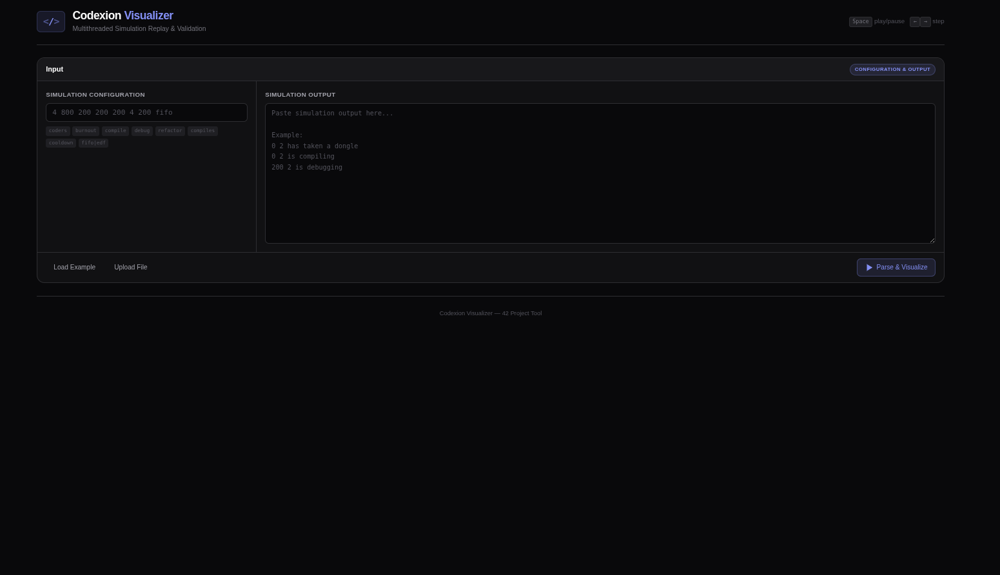
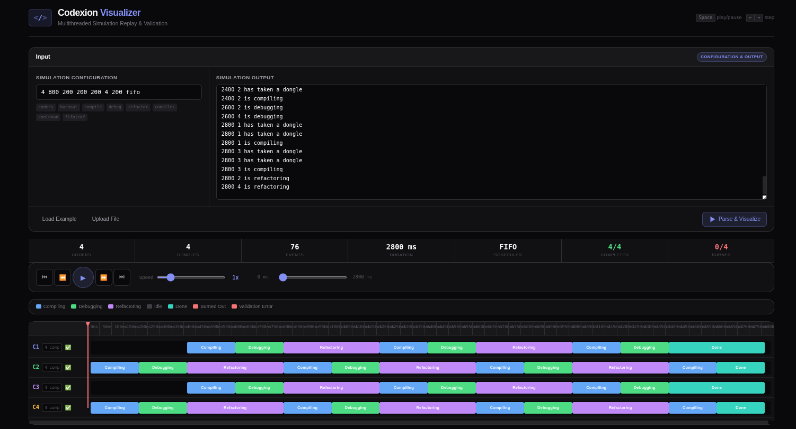
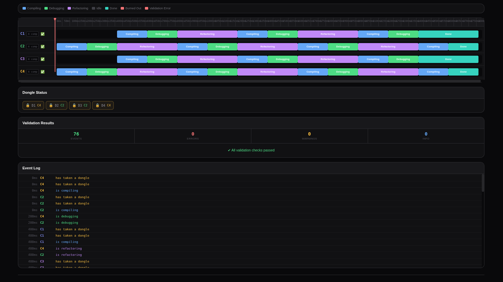
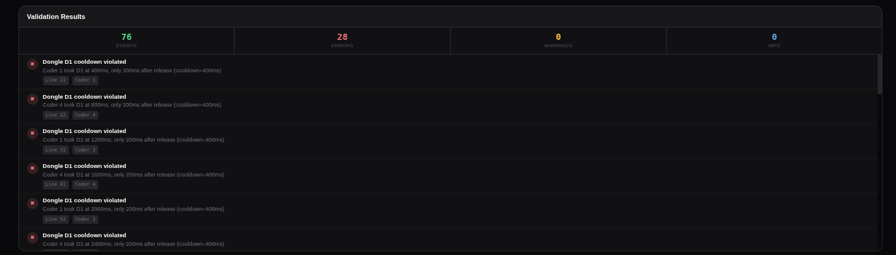

<div align="center">

# 🚀 Codexion Visualizer

### Interactive Multithreaded Simulation Replay & Validation Tool

<p>
A modern web-based visualizer built to replay, analyze and validate Codexion simulation logs in real time.
</p>

<p>

<a href="YOUR_GITHUB_PAGES_LINK">

</a>

<a href="#">

</a>

<a href="#">

</a>

<a href="#">

</a>

</p>

</div>

---

# 🎥 Preview

<p align="center">


</p>

---

# ✨ Overview

**Codexion Visualizer** transforms raw simulation logs into an interactive experience.

Instead of manually reading hundreds of output lines, the application rebuilds the complete execution timeline, allowing you to inspect every coder, every dongle interaction and every state transition with a clean modern interface.

Whether you want to debug your project, verify timing rules or simply understand how your simulation behaves, Codexion Visualizer provides everything in one place.

---

# 🔥 Features

### 🎬 Timeline Replay

Replay the entire simulation from start to finish with smooth controls.

- ▶ Play / Pause
- ⏮ Jump to Start
- ⏭ Jump to End
- ⏪ Step Back
- ⏩ Step Forward
- ⚡ Adjustable Playback Speed

---

### 📊 Live Statistics

Monitor your simulation while replaying.

- Number of Coders
- Number of Dongles
- Scheduler Mode
- Total Events
- Simulation Duration
- Completed Coders
- Burned Coders

---

### 🧠 Smart Validation Engine

The visualizer continuously checks whether the output respects the project rules.

It detects issues such as:

- Invalid timestamps
- Wrong state transitions
- Impossible actions
- Invalid cooldown usage
- Missing events
- Incorrect compile count
- Scheduler inconsistencies
- Unexpected simulation behavior

Every validation result is displayed with detailed explanations.

---

### 🔍 Complete Event Inspector

Every output line becomes an interactive event.

Inspect:

- Current State
- Timestamp
- Active Coder
- Dongle Ownership
- Event History

without manually scrolling through huge log files.

---

### ⚡ Responsive Interface

Designed to work smoothly on

- 💻 Desktop
- 📱 Mobile
- 📟 Tablet

with a modern responsive layout.

---

# 📸 Interface Showcase

## Input & Configuration

<p align="center">



</p>

Configure your simulation parameters and load the generated output.

---

## Interactive Timeline

<p align="center">



</p>

Replay every event with an animated timeline and playback controls.

---

## Validation Engine

<p align="center">



</p>

Automatically detect violations and display detailed validation results.

---

## Error display

<p align="center">



</p>

Explore every event, coder state and simulation detail.

---

# ⚙️ Supported Simulation Parameters

The visualizer accepts the official Codexion configuration format:

```text
<number_of_coders>
<time_to_burnout>
<time_to_compile>
<time_to_debug>
<time_to_refactor>
<number_of_compiles>
<dongle_cooldown>
<fifo | edf>
```

Example

```text
4 800 200 200 200 4 200 fifo
```

---

# 📄 Supported Output Format

Example:

```text
0 2 has taken a dongle
0 2 has taken a dongle
0 2 is compiling
200 2 is debugging
400 2 is refactoring
...
```

The parser automatically reconstructs the complete simulation from these events.

---

# 🛠️ Built With

<p align="center">


</p>

---

# 🌐 Live Demo

The project is available online:

## 👉 **https://YOUR_GITHUB_PAGES_LINK**

---

# 📂 Project Structure

```
.
├── index.html
├── styles.css
├── app.js
├── readme_gif
│   └── output_gif.gif
└── readme_img
    ├── image1.png
    ├── image2.png
    ├── image3.png
    └── image4.png
```

---

# 🎯 Why Codexion Visualizer?

✔ Modern UI

✔ Interactive Timeline

✔ Real-Time Validation

✔ Responsive Design

✔ Fast Parsing

✔ Detailed Event Analysis

✔ Easy Simulation Debugging

✔ Beautiful Visualization

---

<div align="center">

## ⭐ If you found this project useful, consider giving it a star!

Made with ❤️ by **Nasr**

</div>